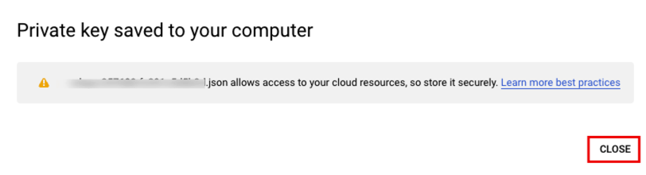

# Authentication to GCP

## Prerequisites
GCP account is required. Account should have permission 

## Task
There are so many providers in Terraform, and each provider has its own way to authenticate to the cloud provider.
Now, we will see how to authenticate to GCP using Terraform.

### Create a service account

### Generate Key
Go to the service account you created, and click the keys tap and create a new key.

### Rename the key file
Rename the key file to `gcp-sa-private-key.json` and move it to `0-authentication/result` folder.