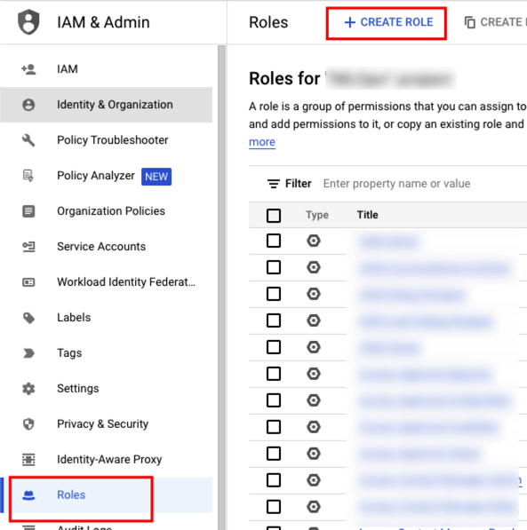
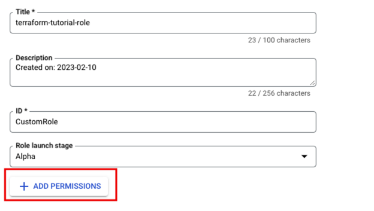
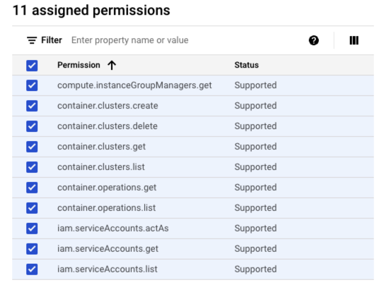
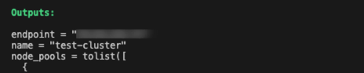

# Create google kubernetes engine

## Prerequisites
GCP account is required. Account should have permission `Service Account User role` (roles/iam.serviceAccountUser) at the project level.

## Task

### Create role
At first, you need to grant permissions to service account you created in `0-authentication` section.
Otherwise, You will get error like this:
```bash
Error: googleapi: Error 403: Required ~ permission(s) for ~ forbidden
```



Add permissions below


### Add service account to iam principal
* Select IAM -> GRANT ACCESS

* Now you will associate the service account you created in `0-authentication` section to the role you created in the previous step.


### create files and folders
* create your own folder somewhere you want.
* create files named `main.tf`, `variables.tf`, `outputs.tf` in your folder.

### `main.tf`
* Write code to athenticate to GCP using [Google Cloud Platform Provider](https://registry.terraform.io/providers/hashicorp/google/latest/docs)
  * credentials should be the file path you created in `0-authentication` section
* Write code to create gke(Google Kubernetes Engine) cluster with 1 node using [Google Kubernetes Engine Provider](https://registry.terraform.io/providers/hashicorp/google/latest/docs/resources/container_cluster)


### `variables.tf`
* Write code to define variables for `main.tf`: credentials, cluster name, region, zone, node count, etc.
* Use the variables in `main.tf`


### `outputs.tf`
* Write code to define outputs for cluster in `main.tf`: cluster name, endpoint, etc.
* You can see outputs from [google_container_cluster](https://registry.terraform.io/providers/hashicorp/google/latest/docs/data-sources/container_cluster)
* The outputs will be shown when you run `terraform apply` or `terraform output`



### Run terraform commands
initialize terraform
```
terraform init
```

see what will be created
```
terraform plan
```

apply the changes
```
terraform apply
```

destroy the changes
```
terraform destroy
```