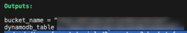

# Use s3 bucket for tfstate

## Prerequisites
In this section, we will use s3 bucket to store terraform state. So, you need to have an AWS account and create an s3 bucket.

## Task

### create files and folders
* create your own folder somewhere you want.
* create files named `s3.tf`, `dynamodb.tf`, `versions.tf`, `versions.tf` in your folder.

### Authenticate to AWS
In this section, you will use [aws provider](https://registry.terraform.io/providers/hashicorp/aws/latest/docs). So, you need ~/.aws/credentials file to store your aws credentials. You can create it by installing aws cli and run `aws configure` command. You can also use environment variables to authenticate to AWS. You can find more information [here](https://registry.terraform.io/providers/hashicorp/aws/latest/docs#authentication)

### `s3.tf`
Define aws provider using region variable
```hcl
provider "aws" {
  region = var.region
}
```

Define s3 bucket
```hcl
resource "aws_s3_bucket" "example" {
  bucket              = var.bucket_name
  object_lock_enabled = true
  force_destroy       = true
}
```

Enable s3 bucket versioning
```hcl
resource "aws_s3_bucket_versioning" "example" {
  bucket = aws_s3_bucket.example.id
  versioning_configuration {
    status = "Enabled"
  }
}
```

Enable s3 bucket server side encryption
```hcl
resource "aws_kms_key" "example" {
  description             = "This key is used to encrypt bucket objects"
  deletion_window_in_days = 10
}

resource "aws_s3_bucket_server_side_encryption_configuration" "example" {
  bucket = aws_s3_bucket.example.id

  rule {
    apply_server_side_encryption_by_default {
      kms_master_key_id = aws_kms_key.example.arn
      sse_algorithm     = "aws:kms"
    }
  }
}
```

Define s3 bucket Object Lock
```hcl
resource "aws_s3_bucket_object_lock_configuration" "example" {
  bucket = aws_s3_bucket.example.id

  rule {
    default_retention {
      mode = "COMPLIANCE"
      days = 5
    }
  }
}
```


### `dynamodb.tf`
Define dynamodb table for terraform state lock
```hcl
resource "aws_dynamodb_table" "terraform_state_lock" {
  name           = var.dynamodb_table
  hash_key       = "LockID"
  billing_mode   = "PAY_PER_REQUEST"

  attribute {
    name = "LockID"
    type = "S"
  }
}
```

### `variables.tf`
* Write code to define variables for `main.tf`: region, s3 bucket name, dynamodb table name, etc.
* Use the variables in `main.tf`


### `versions.tf`
* Define terraform version and provider version
* Define s3 backend configuration
```hcl
terraform {
  required_version = "1.3.7"
  required_providers {
    aws = {
      source  = "hashicorp/aws"
      version = "4.53.0"
    }
  }
}
```


### `outputs.tf`
Define outputs for s3 bucket and dynamodb table.
* You can see outputs from [aws_s3_bucket](https://registry.terraform.io/providers/hashicorp/aws/latest/docs/resources/s3_bucket) and [aws_dynamodb_table](https://registry.terraform.io/providers/hashicorp/aws/latest/docs/resources/dynamodb_table) resources
* The outputs will be shown when you run `terraform apply` or `terraform refresh`



### Run terraform commands
initialize terraform
```
terraform init
```

see what will be created
```
terraform plan
```

apply the changes
```
terraform apply
```