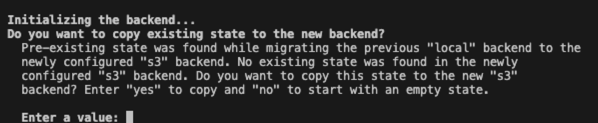
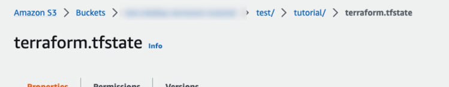

# Use s3 bucket for tfstate

## Prerequisites
In this section, we will use tfstate file from section 1. and s3 bucket created in section 2. So, you need to complete section 1 and section 2.

## Task

### create files and folders
* create your own folder somewhere you want.
* create files named `versions.tf` in your folder.


### Move terraform state file from section 1 to this section
* If you completed section 1, you should have a `terraform.tfstate` file in your folder.
* Copy `terraform.tfstate` file from section 1 to your folder in this section.
* You can remove `terraform.tfstate.backup` file from section 1


### Get s3 bucket name and dynamodb table name from section 2
* If you completed section 2, you can get them from `outputs.tf` file in section 2.
* Run `terraform output` command in section 2 to get them.


### `versions.tf`
Define terraform version and s3 backend configuration using s3 bucket name and dynamodb table name from section 2.
```hcl
terraform {
  required_version = "1.3.7"
  backend "s3" {
    bucket         = <s3 bucket name>
    key            = "test/tutorial/terraform.tfstate"
    region         = "ap-northeast-2"
    dynamodb_table = <dynamodb table name>
    encrypt        = true
  }
}
```


### Run terraform commands
initialize terraform
```
terraform init
```
Then, you can see the following message. It means that terraform is using s3 bucket for tfstate. Enter `yes`.


Check the tfstate file in s3 bucket. You can see the tfstate file in s3 bucket.



### Use s3 bucket for tfstate in all sections

Let's use the tfstate file in s3 bucket from now on to continue this tutorial. All you have to do is define `backend` configuration in `versions.tf` file.
```hcl
terraform {
  required_version = "1.3.7"
  backend "s3" {
    bucket         = <s3 bucket name>
    key            = "test/tutorial/terraform.tfstate"
    region         = "ap-northeast-2"
    dynamodb_table = <dynamodb table name>
    encrypt        = true
  }
}