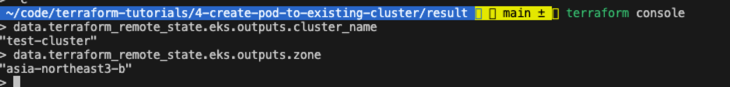
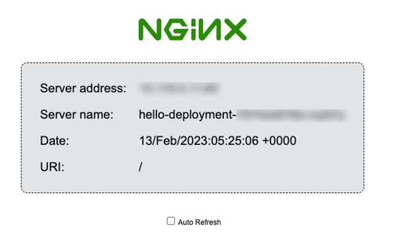

# Create nginx web server to existing cluster

## Prerequisites
In this section, we will use tfstate file from section 3. So, you need to complete section 3.

## Task

### create files and folders
* create your own folder somewhere you want.
* create files named `data.tf`, `main.tf`, `versions.tf` in your folder.

### `versions.tf`
Define terraform version and hashicorp/kubernetes provider version.

To upload tfstate file created from this section to s3 bucket, you need to define `backend` configuration in `versions.tf` file.

Define terraform version and s3 backend configuration using s3 bucket name and dynamodb table name from section 2. However, it is important to define diffent `key` for each section. Otherwise, terraform will override tfstate file created from previous section.
```hcl
terraform {
  required_version = "1.3.7"
  required_providers {
    kubernetes = {
      source  = "hashicorp/kubernetes"
      version = "2.17.0"
    }
  }
  backend "s3" {
    bucket         = <s3 bucket name>
    key            = "test/pod/terraform.tfstate"
    region         = "ap-northeast-2"
    dynamodb_table = <dynamodb table name>
    encrypt        = true
  }
}
```

### `data.tf`
Get cluster name and zone from section 3 by using `data` resource.
If you want to use variables in `data` resource, you have to define variables in `outputs.tf` files from previsous section.
bucket: s3 bucket name created in section 2
key: tfstate file path uploaded in section 3
dynamodb_table: Dynamo table name created in section 2

```hcl
data "terraform_remote_state" "eks" {
  backend = "s3"

  config = {
    bucket         = <s3 bucket name>
    key            = "test/cluster/terraform.tfstate"
    region         = "ap-northeast-2"
    dynamodb_table = <dynamodb table name>
    encrypt        = true
  }
}
```

### Get kubernetes config file using Google Cloud CLI
To get kubernetes config file, you need to install Google Cloud CLI and authenticate to GCP using `gcloud auth login` command.
First, install Google Cloud CLI.
```
curl https://sdk.cloud.google.com | bash
```

Then, authenticate to GCP using `gcloud auth login` command.
```
gcloud auth login
```

Finally, get kubernetes config file using `gcloud container clusters get-credentials` command.
```
gcloud container clusters get-credentials ${data.terraform_remote_state.eks.outputs.cluster_name} --zone ${data.terraform_remote_state.eks.outputs.zone}
```

If you want to figure out what variables are defined in `data.tf`, you can use `terraform console` command. It will open terraform console and you can type `data.terraform_remote_state.eks.outputs.cluster_name` to see what variables are defined.


Check current context is pointing to the cluster you want to use.
```
kubectl config current-context
```

Check the website about [Install the Google Cloud CLI](https://cloud.google.com/sdk/docs/install-sdk)


### `main.tf`
Write code to authenticate to GCP using [Google Cloud Platform Provider](https://registry.terraform.io/providers/hashicorp/google/latest/docs) And use all variables defined in `data.tf`.
```hcl
provider "google" {
  credentials = file("${data.terraform_remote_state.eks.outputs.credentials}")
  region      = data.terraform_remote_state.eks.outputs.region
  zone        = data.terraform_remote_state.eks.outputs.zone
}
```

Write code to authenticate to [hashicorp/kubernetes provider](https://registry.terraform.io/providers/hashicorp/kubernetes/latest/docs)

It will use `~/.kube/config` file to authenticate to kubernetes cluster. And the file is already created in previous step by using `gcloud container clusters get-credentials` command.

```hcl
provider "kubernetes" {
  config_path = "~/.kube/config"
}
```

Write code to create nginx web server using [hashicorp/kubernetes provider](https://registry.terraform.io/providers/hashicorp/kubernetes/latest/docs)
```hcl
resource "kubernetes_deployment_v1" "hello_world" {
  metadata {
    name = "hello-deployment"
  }

  spec {
    replicas = 1

    selector {
      match_labels = {
        run = "hello-world"
      }
    }

    template {
      metadata {
        labels = {
          run = "hello-world"
        }
      }

      spec {
        container {
          image = "nginxdemos/hello:latest"
          name  = "hello"
          port {
            container_port = 80
          }
        }
      }
    }
  }
}

resource "kubernetes_service_v1" "hello_world" {
  metadata {
    name = "hello-service"
    labels = {
      run = "hello-world"
    }
  }
  spec {
    selector = {
      run = "hello-world"
    }
    port {
      port = 80
      protocol = "TCP"
    }
    type = "LoadBalancer"
  }
}
```

Define output variables to get service ip address and port.
```hcl
output "web_url" {
  value = kubernetes_service_v1.hello_world.status.0.load_balancer.0.ingress.0.ip
}
```

Check the web server is running when you access the web_url.


### Run terraform commands
initialize terraform
```
terraform init
```

see what will be created
```
terraform plan
```

apply the changes
```
terraform apply
```

destroy the changes
```
terraform destroy
```